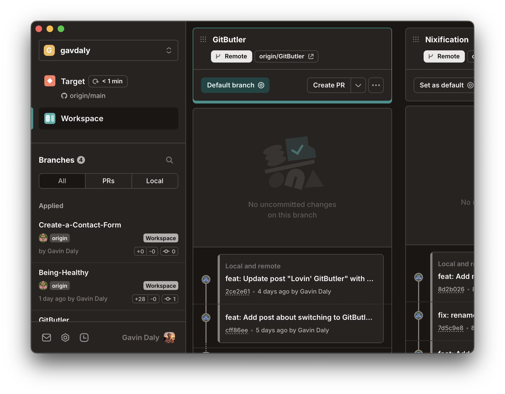

## Headless Branches and Improving GIT?

I watched a video on YouTube about a cool new tool called `jj` that allows you to create headless branches in Git. I thought it was a cool idea, so I decided to give it a try. It was a problem to push changes to the remote repository. So I put it on the back burner. Tried some of the other apps that are supposed to make Git easier to use. But I alwasys had branching problems.

Then heard on the changelog podcast about GitButler. I decided to give it a try. I'm Lovin' It!

## Visually move files to different branches.

This is my favourite feature. Seeing the changes and moving the files where appropriate is such a nice change. When you make more changes to a file you can add it to a previous commit and force push it to the remote repository.

## Easily make pull requests and integrate to GitHub.

On personal projects I'd normally just push to the master branch. But now I can easily create a branch and push to it. Then create a pull request to merge the changes. It's so easy!

## Visual representation of the branches and the changes.

I like the visual representation of the gitbranches, it's easy to see what changes you have going and what you are working on.

## Needed Improvements

I would like to have better integration into IDE's and a TUI would be nice. And an API to integrate into other tools.

## Conclusion

I'm Lovin' GitButler. It's made my life so much easier. I can easily create branches, push changes, and create pull requests. It's so easy to use and has made my life so much easier. I highly recommend it to anyone who uses Git and GitHub.
